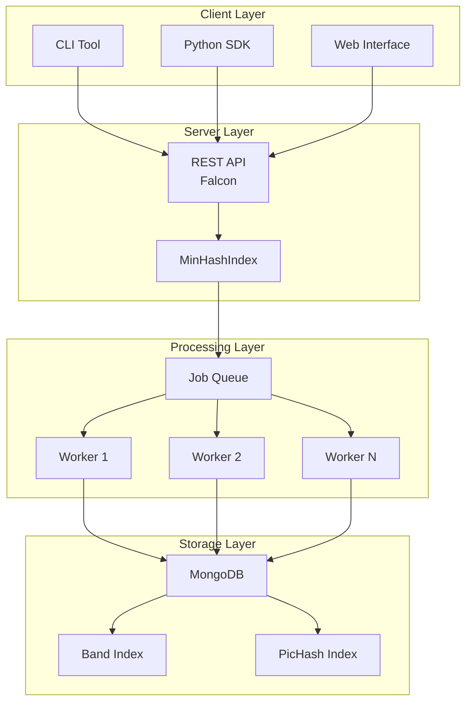
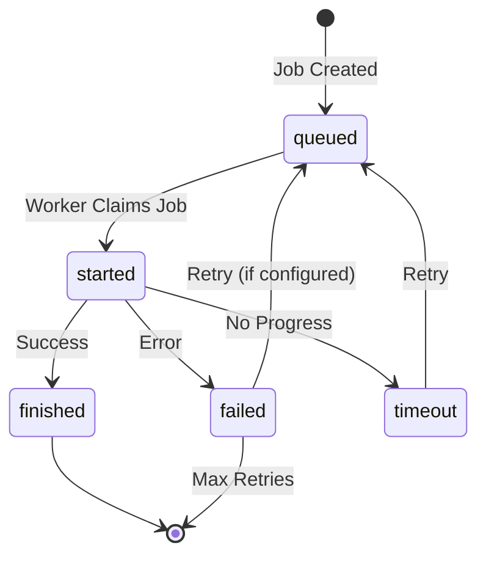
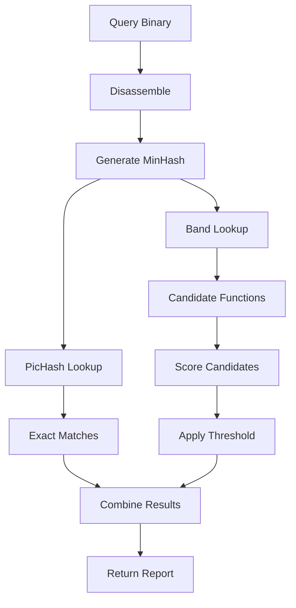

MCRIT is a distributed system designed for large-scale binary code analysis. This page explains the architecture, components, and how data flows through the system.

## Architecture Overview

MCRIT follows a **client-server architecture** with asynchronous job processing:



## Core Components

### Server Component (REST API)

The server provides a REST API built with [Falcon](https://falconframework.org/), a high-performance Python web framework.

<CardGroup cols={2}>
  <Card title="FamilyResource" icon="folder-tree">
    Manage malware families
    
    `/families`, `/family/{id}`
  </Card>
  
  <Card title="SampleResource" icon="file-binary">
    Import and manage samples
    
    `/samples`, `/sample/{id}`
  </Card>
  
  <Card title="FunctionResource" icon="function">
    Query function details
    
    `/functions`, `/function/{id}`
  </Card>
  
  <Card title="QueryResource" icon="magnifying-glass">
    Query by binary or PicHash
    
    `/query/*`
  </Card>
  
  <Card title="MatchResource" icon="code-compare">
    Get matching results
    
    `/matches/*`
  </Card>
  
  <Card title="JobResource" icon="list-check">
    Monitor job status
    
    `/jobs`, `/job/{id}`
  </Card>
</CardGroup>

**Key characteristics:**
- **Stateless** - No session management
- **Asynchronous** - Long operations return job IDs
- **REST-compliant** - Standard HTTP methods and status codes

Source: `mcrit/server/application_routes.py`

### MinHashIndex

The `MinHashIndex` is the main entry point for all analysis operations. It coordinates between the API, storage, and workers.

<Tabs>
  <Tab title="Responsibilities">
    - **Sample Management** - Import/delete samples
    - **Query Coordination** - Route queries to workers
    - **Result Retrieval** - Fetch completed job results
    - **Index Maintenance** - Rebuild indices, cleanup
    - **Configuration** - Manage thresholds and settings
  </Tab>
  
  <Tab title="Key Methods">
    ```python
    class MinHashIndex:
        # Sample operations
        def addReport(self, smda_report, calculate_hashes=True)
        def deleteSample(self, sample_id)
        
        # Query operations (delegated to workers)
        def getMatchesForSmdaReport(self, report_json)
        def getMatchesForUnmappedBinary(self, binary)
        def getMatchesForSample(self, sample_id)
        
        # PicHash lookups (direct)
        def getMatchesForPicHash(self, pichash)
        def getMatchesForPicBlockHash(self, picblockhash)
        
        # Index management
        def rebuildIndex()
        def updateMinHashes(self, function_ids)
    ```
  </Tab>
  
  <Tab title="Delegation Pattern">
    MinHashIndex uses the `QueueRemoteCaller` pattern to delegate expensive operations to workers:
    
    ```python
    class MinHashIndex(QueueRemoteCaller(Worker)):
        # Methods decorated with @Remote are executed by workers
        pass
    ```
    
    When you call a delegated method, MinHashIndex:
    1. Creates a job in the queue
    2. Returns a job ID immediately
    3. A worker picks up the job asynchronously
    4. Results are stored when complete
  </Tab>
</Tabs>

Source: `mcrit/index/MinHashIndex.py:61`

## Worker Components

MCRIT supports three worker types for different deployment scenarios:

### Worker (Base Class)

Standard worker that processes jobs synchronously in its own context.

```python
from mcrit.Worker import Worker

with Worker() as worker:
    worker.start()  # Process jobs from queue
```

**Characteristics:**
- One job at a time
- Keeps state in memory
- Good for: Docker deployments, simple setups

Source: `mcrit/Worker.py:50`

### SpawningWorker

Spawns a new process (SingleJobWorker) for each job, providing isolation.

```python
from mcrit.SpawningWorker import SpawningWorker

with SpawningWorker() as worker:
    worker.start()  # Spawns child processes for jobs
```

**Characteristics:**
- Spawns subprocess for each job
- Better fault isolation
- Memory cleanup between jobs
- Good for: Long-running services, memory leak protection

**Implementation:**
```python
def _executeJobPayload(self, job_payload, job):
    # Spawn a new process
    console_handle = subprocess.Popen(
        ["python", "-m", "mcrit", "singlejobworker", "--job_id", str(job.job_id)],
        stdout=subprocess.PIPE, 
        stderr=subprocess.PIPE
    )
    stdout_result, stderr_result = console_handle.communicate(
        timeout=QUEUE_SPAWNINGWORKER_CHILDREN_TIMEOUT
    )
```

Source: `mcrit/SpawningWorker.py:51`

### SingleJobWorker

Processes exactly one job then exits. Used by SpawningWorker or for manual job processing.

```python
from mcrit.SingleJobWorker import SingleJobWorker

worker = SingleJobWorker(job_id=12345)
worker.run()  # Process this specific job, then exit
```

**Characteristics:**
- One job, then terminate
- Clean process per job
- Good for: Spawned by SpawningWorker, debugging specific jobs

Source: `mcrit/SingleJobWorker.py:52`

## Storage Layer (MongoDB)

MCRIT uses MongoDB for all persistent storage with specialized indices for performance.

### Collections

<AccordionGroup>
  <Accordion title="families">
    Malware family metadata
    
    ```javascript
    {
      family_id: 1,
      family_name: "Emotet",
      num_samples: 456,
      num_functions: 12890,
      is_library: false
    }
    ```
  </Accordion>
  
  <Accordion title="samples">
    Binary sample metadata
    
    ```javascript
    {
      sample_id: 100,
      family_id: 1,
      sha256: "a3f5e8b2...",
      filename: "emotet.exe",
      architecture: "intel",
      bitness: 32,
      base_addr: 0x400000,
      statistics: {
        num_functions: 234,
        num_instructions: 45678
      }
    }
    ```
  </Accordion>
  
  <Accordion title="functions">
    Function entries with MinHash signatures
    
    ```javascript
    {
      function_id: 5000,
      sample_id: 100,
      family_id: 1,
      offset: 0x401000,
      function_name: "sub_401000",
      pichash: NumberLong("8845632100997654321"),
      minhash: BinData(0, "..."),  // 256-byte signature
      num_instructions: 45,
      num_blocks: 8
    }
    ```
    
    **Indices:**
    - `{function_id: 1}` - Primary key
    - `{sample_id: 1}` - Functions by sample
    - `{pichash: 1}` - Fast PicHash lookup
  </Accordion>
  
  <Accordion title="bands">
    MinHash band index for LSH
    
    ```javascript
    {
      band_id: "hash_of_band_values",
      band_number: 15,
      function_ids: [5000, 5123, 7890, ...]
    }
    ```
    
    Each function's signature is split into bands (e.g., 64 bands × 4 values). Functions sharing a band hash are candidates.
    
    **Index:**
    - `{band_id: 1, band_number: 1}` - Fast candidate lookup
  </Accordion>
  
  <Accordion title="picblockhashes">
    Basic block hash index
    
    ```javascript
    {
      hash: NumberLong("9876543210123456789"),
      family_id: 1,
      sample_id: 100,
      function_id: 5000,
      offset: 0x401010
    }
    ```
    
    **Index:**
    - `{hash: 1}` - Fast block lookup
  </Accordion>
  
  <Accordion title="jobs">
    Asynchronous job tracking
    
    ```javascript
    {
      job_id: "a3f5e8b2-c1d4-e6f7-a9b0-123456789abc",
      method: "getMatchesForSmdaReport",
      state: "finished",
      parameters: {...},
      result_id: "result_sha256",
      created_at: ISODate("2026-03-04T10:30:00Z"),
      started_at: ISODate("2026-03-04T10:30:05Z"),
      finished_at: ISODate("2026-03-04T10:35:23Z")
    }
    ```
  </Accordion>
</AccordionGroup>

Source: `mcrit/storage/MongoDbStorage.py`

### Band Index Structure

The band index is critical for MinHash performance:

```python
# Example: 256-value signature, 64 bands, 4 rows per band
for band_num in range(64):
    band_values = minhash.minhash_int[band_num*4:(band_num+1)*4]
    band_hash = hash(tuple(band_values))
    
    # Store in MongoDB
    db.bands.update_one(
        {"band_id": band_hash, "band_number": band_num},
        {"$addToSet": {"function_ids": function_id}}
    )
```

**Query process:**
1. Calculate bands for query function
2. Lookup all bands in index
3. Collect all function IDs appearing in any band
4. These are MinHash candidates
5. Score candidates against query

## Job Queue System

MCRIT uses a job queue for asynchronous processing of expensive operations.

### Queue Implementations

<Tabs>
  <Tab title="LocalQueue">
    **In-memory queue** using Python multiprocessing
    
    - **Use case:** Development, testing, single-node deployments
    - **Persistence:** None (jobs lost on restart)
    - **Scalability:** Single machine only
    
    ```python
    from mcrit.queue.LocalQueue import LocalQueue
    queue = LocalQueue()
    ```
  </Tab>
  
  <Tab title="MongoQueue">
    **MongoDB-backed queue** (default for production)
    
    - **Use case:** Production deployments
    - **Persistence:** Jobs survive restarts
    - **Scalability:** Multiple workers across machines
    
    ```python
    from mcrit.queue.QueueFactory import QueueFactory
    queue = QueueFactory.getQueue(config)  # Returns MongoQueue
    ```
  </Tab>
</Tabs>

### Job Lifecycle



### Job Types

Common jobs in MCRIT:

- **`addBinarySample`** - Disassemble and import binary
- **`updateMinHashesForSample`** - Calculate MinHash signatures
- **`getMatchesForSmdaReport`** - Match query against database
- **`getMatchesForSample`** - Match sample vs all others
- **`combineMatchesToCross`** - Cross-matching analysis
- **`deleteSample`** - Remove sample and cleanup indices
- **`rebuildIndex`** - Recreate band index from scratch

Source: `mcrit/queue/LocalQueue.py`, `mcrit/Worker.py`

## Data Flow: Sample Import

Let's trace what happens when you import a binary:

<Steps>
  <Step title="Client Submits Binary">
    ```python
    client.addBinarySample(
        binary_bytes,
        family="Emotet",
        is_dump=False
    )
    ```
  </Step>
  
  <Step title="API Creates Job">
    The REST API receives the request and creates a job:
    ```python
    job_id = index.addBinarySample(...)
    # Returns immediately with job_id
    ```
  </Step>
  
  <Step title="Worker Picks Up Job">
    A worker claims the job from the queue and executes:
    - **Disassemble** with SMDA
    - **Create SampleEntry** in MongoDB
    - **Create FunctionEntry** for each function
  </Step>
  
  <Step title="Calculate Hashes">
    If `calculate_hashes=True`, spawns another job:
    - **Generate MinHash** for each function
    - **Calculate PicHash** for each function
    - **Store signatures** in MongoDB
  </Step>
  
  <Step title="Build Index">
    - **Split MinHash into bands**
    - **Insert into band index**
    - **Insert into PicHash index**
  </Step>
  
  <Step title="Job Complete">
    Worker marks job as finished, stores result
  </Step>
  
  <Step title="Client Polls Result">
    ```python
    status = client.getStatusForJob(job_id)
    if status["state"] == "finished":
        result = client.getResultForJob(job_id)
    ```
  </Step>
</Steps>

## Data Flow: Query Matching

When querying a new binary:

<Steps>
  <Step title="Submit Query">
    ```python
    job_id = client.getMatchesForUnmappedBinary(binary_bytes)
    ```
  </Step>
  
  <Step title="Disassemble">
    Worker disassembles binary with SMDA (query sample, not stored)
  </Step>
  
  <Step title="Calculate MinHash">
    Generate MinHash signatures for all functions
  </Step>
  
  <Step title="PicHash Lookup">
    Check PicHash index for exact matches (very fast)
  </Step>
  
  <Step title="Band Lookup">
    Query band index for MinHash candidates
  </Step>
  
  <Step title="Score Candidates">
    Calculate MinHash scores for all candidates
  </Step>
  
  <Step title="Apply Threshold">
    Filter matches by configured threshold (e.g., 50%)
  </Step>
  
  <Step title="Return Results">
    Aggregate matches by sample/family, return matching report
  </Step>
</Steps>



## Scalability Considerations

<CardGroup cols={2}>
  <Card title="Horizontal Scaling" icon="server">
    Run multiple workers to parallelize matching
    
    Each worker can operate independently
  </Card>
  
  <Card title="Database Sharding" icon="database">
    MongoDB supports sharding for very large datasets
    
    Shard by family_id or sample_id
  </Card>
  
  <Card title="Query Optimization" icon="gauge-high">
    Use PicHash for initial filtering
    
    Adjust band configuration for speed/recall tradeoff
  </Card>
  
  <Card title="Storage Optimization" icon="hard-drive">
    Use 8-bit MinHash signatures (4x less storage)
    
    Optionally drop xcfg after indexing
  </Card>
</CardGroup>

## Configuration Points

Key configuration files:

- **`McritConfig`** - Overall system config
- **`MinHashConfig`** - Signature length, bits, thresholds
- **`ShinglerConfig`** - Shingler weights and parameters
- **`StorageConfig`** - MongoDB connection and settings
- **`QueueConfig`** - Job queue configuration

Source: `mcrit/config/`

## Deployment Patterns

<Tabs>
  <Tab title="Single Node">
    **All-in-one deployment:**
    - Server + Worker + MongoDB on one machine
    - Use LocalQueue or MongoQueue
    - Good for: Small datasets (under 100k functions), development
    
    ```bash
    # Terminal 1: Start MongoDB
    mongod --dbpath ./data
    
    # Terminal 2: Start Server
    mcrit server
    
    # Terminal 3: Start Worker
    mcrit worker
    ```
  </Tab>
  
  <Tab title="Multi-Worker">
    **Scaled processing:**
    - One server node
    - Multiple worker nodes
    - Shared MongoDB
    - Good for: Large imports, heavy matching workloads
    
    ```bash
    # Server node
    mcrit server
    
    # Worker node 1
    mcrit worker
    
    # Worker node 2
    mcrit worker
    
    # Worker node N
    mcrit worker
    ```
  </Tab>
  
  <Tab title="Docker Compose">
    **Containerized deployment:**
    ```yaml
    version: '3'
    services:
      mongodb:
        image: mongo:5
        volumes:
          - ./data:/data/db
      
      server:
        image: mcrit:latest
        command: server
        depends_on:
          - mongodb
      
      worker:
        image: mcrit:latest
        command: spawningworker
        depends_on:
          - mongodb
        deploy:
          replicas: 4
    ```
  </Tab>
</Tabs>

## Related Concepts

<CardGroup cols={2}>
  <Card title="MinHash" icon="fingerprint" href="/concepts/minhash">
    How signatures are generated and indexed
  </Card>
  <Card title="Shinglers" icon="puzzle-piece" href="/concepts/shinglers">
    Feature extraction in the worker
  </Card>
  <Card title="PicHash" icon="hashtag" href="/concepts/pichash">
    Exact matching in the index
  </Card>
</CardGroup>