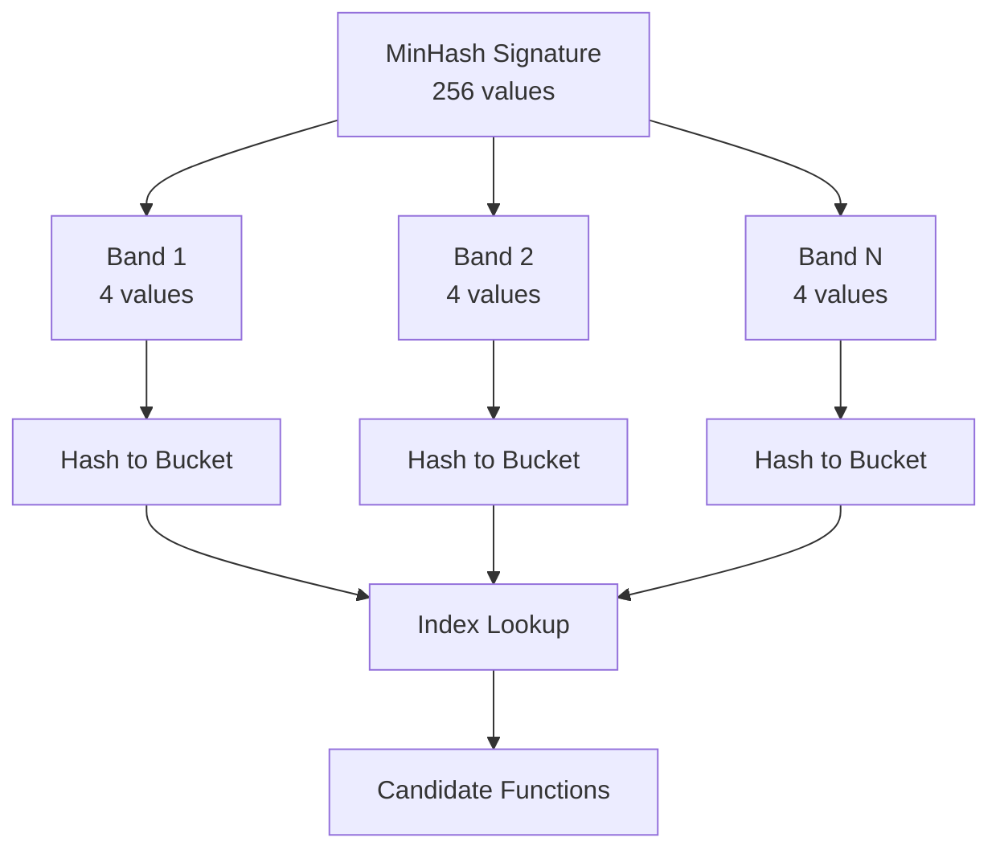

MinHash is a locality-sensitive hashing technique that MCRIT uses to efficiently identify similar code functions. This page explains how MinHash works and how MCRIT applies it for binary code analysis.

## What is MinHash?

MinHash (Minwise Hashing) is a probabilistic algorithm for estimating the similarity between sets. In MCRIT, these sets are collections of **shingles** extracted from disassembled functions.

The key insight: if two functions have similar MinHash signatures, they likely contain similar code patterns, even across different compilers or optimization levels.

## MinHash in MCRIT

MCRIT uses MinHash to create compact fingerprints of binary functions that can be compared efficiently.

### Core Components

<CardGroup cols={2}>
  <Card title="MinHash Class" icon="fingerprint" href="#minhash-class">
    Data Transfer Object storing MinHash signatures
  </Card>
  <Card title="MinHasher Class" icon="calculator" href="#minhasher-class">
    Generates MinHash signatures from functions
  </Card>
  <Card title="MinHashIndex" icon="database" href="#band-based-indexing">
    Band-based index for fast candidate retrieval
  </Card>
  <Card title="Scoring" icon="chart-line" href="#scoring-and-thresholds">
    Comparing signatures and determining matches
  </Card>
</CardGroup>

## MinHash Class

The `MinHash` class is a DTO (Data Transfer Object) that stores a MinHash signature.

<CodeGroup>
```python Source Reference
# From mcrit/minhash/MinHash.py
class MinHash(object):
    _HASH_MAX = 0xFFFFFFFF
    _MINHASH_BITS = 32
    
    def __init__(self, function_id=None, minhash_bytes=None, 
                 minhash_signature=None, minhash_bits=32):
        self.minhash = b""  # Binary representation
        self.minhash_int = []  # Integer list representation
        self.shingler_composition = {}  # Which shinglers contributed
        self.function_id = function_id
```
</CodeGroup>

<Note>
The MinHash signature can be stored as either a byte array (`minhash`) or integer list (`minhash_int`). MCRIT uses 32-bit or 8-bit signatures depending on configuration.
</Note>

### Key Methods

- **`calculateMinHashScore(first, second)`** - Computes similarity between two signatures (0-100%)
- **`hashData(data, seed)`** - Hashes data using MurmurHash3 (mmh3)
- **`scoreAgainst(other)`** - Scores this MinHash against another

Source: `mcrit/minhash/MinHash.py:13`

## MinHasher Class

The `MinHasher` generates MinHash signatures from disassembled functions. It orchestrates multiple shinglers and applies one of three strategies.

### MinHash Generation Strategies

MCRIT supports three strategies for generating MinHash signatures:

<Tabs>
  <Tab title="HASH_ALL">
    **Strategy 1: Hash All Seeds**
    
    For each hash seed:
    1. Generate shingles using all configured shinglers
    2. Take the minimum shingle from each shingler
    3. Select the global minimum across all shinglers
    
    This is the most thorough but slowest approach.
    
    Source: `mcrit/minhash/MinHasher.py:126`
  </Tab>
  
  <Tab title="XOR_ALL">
    **Strategy 2: XOR All Shingles**
    
    1. Generate all shingles once (with seed=0)
    2. For each position in signature:
       - XOR all shingles with a random value
       - Take minimum XOR'd shingle per shingler
       - Select global minimum
    
    Much faster than HASH_ALL while maintaining good accuracy.
    
    Source: `mcrit/minhash/MinHasher.py:154`
  </Tab>
  
  <Tab title="SEGMENTED">
    **Strategy 3: Segmented by Weight**
    
    1. Divide signature into segments based on shingler weights
    2. Each segment is dedicated to a specific shingler
    3. XOR shingles and take minimum within each segment
    
    Provides balanced representation from all shinglers.
    
    Source: `mcrit/minhash/MinHasher.py:186`
  </Tab>
</Tabs>

### Configuration

```python
# Key configuration parameters
MINHASH_SIGNATURE_LENGTH = 256  # Number of hash values in signature
MINHASH_SIGNATURE_BITS = 32     # Bits per hash value (8 or 32)
MINHASH_SEED = 0x12345          # Random seed for reproducibility
MINHASH_MATCHING_THRESHOLD = 50 # Minimum score for a match
```

## Band-Based Indexing

MCRIT uses **Locality-Sensitive Hashing (LSH)** with band-based indexing to avoid comparing every function against every other function.

### How It Works

<Steps>
  <Step title="Divide Signature into Bands">
    A MinHash signature of length 256 might be divided into 64 bands of 4 hashes each.
  </Step>
  
  <Step title="Hash Each Band">
    Each band is hashed to create a bucket identifier.
  </Step>
  
  <Step title="Store in Index">
    Functions with the same band hash are stored in the same bucket.
  </Step>
  
  <Step title="Query">
    When querying, only functions sharing at least one band bucket are candidates.
  </Step>
</Steps>



<Note>
The number of bands and rows per band determines the threshold at which similar functions are likely to be found. More bands increase recall but require more storage.
</Note>

Source: `mcrit/index/MinHashIndex.py:61`

## Scoring and Thresholds

### MinHash Score Calculation

The similarity score between two MinHash signatures is the percentage of matching hash values:

```python
score = 100.0 * (number_of_matching_hashes / signature_length)
```

For example, if 180 out of 256 hash values match:
```
score = 100.0 * (180 / 256) = 70.3%
```

Source: `mcrit/minhash/MinHash.py:84`

### Matching Threshold

By default, MCRIT considers functions to match if their MinHash score exceeds the configured threshold (typically 50%).

<Tip>
You can adjust the matching threshold dynamically:
- **Higher threshold** (70-90%): Fewer false positives, may miss similar functions
- **Lower threshold** (30-50%): More matches, but more false positives
- **Very low threshold** (10-30%): Useful for finding loosely related code
</Tip>

### Shingler Composition Tracking

MCRIT can track which shinglers contributed to each position in the signature:

```python
minhash.shingler_composition = {
    "EscapedBlockShingler": {"count": 180, "size": 245},
    "FuzzyStatPairShingler": {"count": 76, "size": 156}
}
```

This helps understand what code characteristics drove the similarity match.

Source: `mcrit/minhash/MinHasher.py:159`

## Trade-offs: Speed vs Accuracy

<AccordionGroup>
  <Accordion title="Signature Length">
    **Longer signatures** (512+ values):
    - ✅ More accurate similarity estimates
    - ✅ Better discrimination between similar functions
    - ❌ Slower to compute and compare
    - ❌ More storage required
    
    **Shorter signatures** (64-128 values):
    - ✅ Faster computation and comparison
    - ✅ Less storage
    - ❌ Less accurate
    - ❌ More false positives
  </Accordion>
  
  <Accordion title="Signature Bits">
    **32-bit hashes**:
    - ✅ Standard approach, well-tested
    - ✅ Extremely low collision rate
    - ❌ 4 bytes per hash value
    
    **8-bit hashes**:
    - ✅ 4x less storage
    - ✅ Faster to compare
    - ❌ Higher collision rate
    - ❌ Less accurate for small signatures
  </Accordion>
  
  <Accordion title="Band Configuration">
    **More bands** (128 bands × 2 rows):
    - ✅ Better recall (finds more matches)
    - ✅ Can find very similar functions reliably
    - ❌ More index storage
    - ❌ More candidate functions to verify
    
    **Fewer bands** (32 bands × 8 rows):
    - ✅ Less storage overhead
    - ✅ Fewer candidates to verify
    - ❌ May miss marginally similar functions
    - ❌ Requires higher similarity to match
  </Accordion>
  
  <Accordion title="MinHash Strategy">
    **HASH_ALL**:
    - ✅ Most thorough
    - ❌ Slowest (10-100x slower)
    
    **XOR_ALL**:
    - ✅ Good balance
    - ✅ Recommended for most use cases
    
    **SEGMENTED**:
    - ✅ Fastest
    - ✅ Guarantees shingler representation
    - ❌ May be less discriminative
  </Accordion>
</AccordionGroup>

## Minimum Function Requirements

Not all functions are suitable for MinHashing. MCRIT requires functions to meet minimum thresholds:

```python
# Configuration from MinHasher
MINHASH_FN_MIN_BLOCKS = 2      # Minimum basic blocks
MINHASH_FN_MIN_INS = 5         # Minimum instructions
```

Tiny functions (like simple getters/setters) often produce identical or very similar MinHashes, leading to false positives.

Source: `mcrit/minhash/MinHasher.py:50`

## Related Concepts

<CardGroup cols={2}>
  <Card title="Shinglers" icon="puzzle-piece" href="/concepts/shinglers">
    Learn how code features are extracted into shingles
  </Card>
  <Card title="PicHash" icon="fingerprint" href="/concepts/pichash">
    Exact matching using position-independent hashing
  </Card>
  <Card title="Architecture" icon="diagram-project" href="/concepts/architecture">
    See how MinHash fits into MCRIT's overall design
  </Card>
</CardGroup>

## Further Reading

- [MinHash Wikipedia](https://en.wikipedia.org/wiki/MinHash)
- [Locality-Sensitive Hashing](https://en.wikipedia.org/wiki/Locality-sensitive_hashing)
- [MurmurHash3](https://en.wikipedia.org/wiki/MurmurHash)