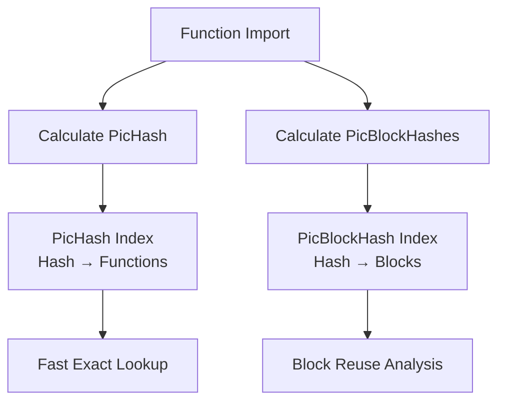

PicHash (Position-Independent Code Hash) provides fast, exact matching of code functions in MCRIT. Unlike MinHash's approximate similarity, PicHash identifies identical code regardless of where it's loaded in memory.

## What is PicHash?

PicHash is a 64-bit hash of a function's bytes after normalizing position-dependent elements:

- **Absolute addresses** → Escaped/removed
- **Intraprocedural jumps** → Normalized to offsets
- **Everything else** → Hashed as-is

This creates a fingerprint that's stable across:
- Different base addresses (ASLR)
- Different positions in the binary
- Different builds (if code unchanged)

## PicHash vs PicBlockHash

MCRIT uses two levels of position-independent hashing:

<CardGroup cols={2}>
  <Card title="PicHash" icon="fingerprint">
    **Function-level** hash
    
    Computed from entire function's bytes
    
    One hash per function
    
    Used for: Finding identical functions
  </Card>
  
  <Card title="PicBlockHash" icon="cube">
    **Basic block-level** hash
    
    Computed for each basic block
    
    Multiple hashes per function
    
    Used for: Finding code reuse, partial matches
  </Card>
</CardGroup>

## How PicHash Works

### Function-Level PicHash

<Steps>
  <Step title="Escape Instructions">
    Use SMDA's `IntelInstructionEscaper` to normalize position-dependent bytes:
    ```python
    # Example instruction transformation
    call 0x401000 → call <OFFSET>
    mov eax, [0x403000] → mov eax, [<ADDR>]
    jnz 0x4010A0 → jnz <OFFSET>
    ```
  </Step>
  
  <Step title="Concatenate Blocks">
    Join escaped bytes from all basic blocks in function
  </Step>
  
  <Step title="Hash with SHA-256">
    Take first 8 bytes of SHA-256 hash:
    ```python
    import hashlib
    import struct
    
    pic_hash = struct.unpack("Q", 
        hashlib.sha256(escaped_bytes).digest()[:8]
    )[0]
    ```
  </Step>
</Steps>

**Result:** A 64-bit integer that's stable across position changes.

MCRIT automatically computes PicHash for every function during import. It's stored in the `FunctionEntry`:

```python
function_entry.pichash  # 64-bit integer
```

Source: `mcrit/storage/FunctionEntry.py:34`

### Block-Level PicBlockHash

<Tabs>
  <Tab title="Overview">
    Each basic block gets its own hash, enabling detection of:
    - **Code reuse** (same block in different functions)
    - **Partial matches** (some blocks match, others don't)
    - **Unique blocks** (blocks appearing in only one family)
  </Tab>
  
  <Tab title="Generation">
    ```python
    # From mcrit/matchers/FunctionCfgMatcher.py
    def getPicBlockHashesForFunction(sample_entry, smda_function, min_size=0):
        pic_block_hashes = []
        for block in smda_function.getBlocks():
            if block.length >= min_size:
                escaped_binary_seq = []
                for instruction in block.getInstructions():
                    escaped_binary_seq.append(
                        instruction.getEscapedBinary(
                            IntelInstructionEscaper,
                            escape_intraprocedural_jumps=True,
                            lower_addr=sample_entry.base_addr,
                            upper_addr=sample_entry.base_addr + sample_entry.binary_size
                        )
                    )
                as_bytes = bytes([ord(c) for c in "".join(escaped_binary_seq)])
                hashed = struct.unpack("Q", 
                    hashlib.sha256(as_bytes).digest()[:8]
                )[0]
                pic_block_hashes.append({
                    "offset": block.offset,
                    "hash": hashed,
                    "size": block.length
                })
        return pic_block_hashes
    ```
  </Tab>
  
  <Tab title="Storage">
    Block hashes are stored as a list in `FunctionEntry`:
    ```python
    function_entry.picblockhashes = [
        {"offset": 0x1000, "hash": 0x7A3B2C..., "size": 15},
        {"offset": 0x100F, "hash": 0x9D4E5F..., "size": 8},
        # ... more blocks
    ]
    ```
  </Tab>
</Tabs>

Source: `mcrit/matchers/FunctionCfgMatcher.py:33`

## Integration with picblocks Library

MCRIT uses the external [picblocks](https://github.com/danielplohmann/picblocks) library for some PicHash operations:

```python
from picblocks.blockhasher import BlockHasher

# BlockHasher handles position-independent hashing
# Integrates with SMDA for instruction escaping
```

The picblocks library provides:
- **BlockHasher** - Generates PicBlockHashes
- **YARA rule generation** - Creates rules from unique blocks
- **Visualization** - Shows block reuse patterns

Source: `mcrit/storage/MongoDbStorage.py` (import statement)

## Use Cases

### 1. Exact Function Matching

PicHash enables instant lookup of known functions:

```python
# Check if a function is already indexed
matches = index.getMatchesForPicHash(0x7A3B2C1D9E4F5A6B)
# Returns: [(family_id, sample_id, function_id), ...]
```

**Use cases:**
- Library function identification
- Finding exact code clones
- Deduplication across samples

<Note>
PicHash matching is **much faster** than MinHash (~1000x) because it's a simple hash table lookup instead of LSH candidate generation.
</Note>

### 2. Unique Block Identification

Find basic blocks that appear only in a specific family:

```python
unique_blocks = index.getUniqueBlocks(sample_ids=[1, 2, 3])
# Returns blocks that are unique to these samples
```

**Applications:**
- **YARA rule generation** - Create signatures for malware families
- **Code attribution** - Identify distinctive code patterns
- **Threat hunting** - Find specific implementations

Source: `mcrit/storage/UniqueBlocksResult.py:26`

### 3. Partial Function Matching

Compare which basic blocks match between two functions:

```python
matcher = FunctionCfgMatcher(sample_a, func_a, sample_b, func_b)
block_matches = matcher.getAllPicblockMatches()
# Returns: {"a": {block_offsets}, "b": {block_offsets}}
```

**Use cases:**
- Understanding code evolution
- Finding partially modified functions
- Visualizing code reuse

## Query Endpoints

MCRIT's REST API provides PicHash query endpoints:

### Query by PicHash

```bash
curl http://localhost:8000/query/pichash/7A3B2C1D9E4F5A6B
```

Returns all functions with this PicHash:
```json
{
  "status": "successful",
  "data": [
    [1, 100, 5000],  // [family_id, sample_id, function_id]
    [1, 101, 5234],
    [2, 150, 7890]
  ]
}
```

Source: `mcrit/server/QueryResource.py:90`

### Query by PicBlockHash

```bash
curl http://localhost:8000/query/picblockhash/9D4E5F6A7B8C9D0E
```

Returns all blocks with this hash:
```json
{
  "status": "successful",
  "data": [
    [1, 100, 5000, 0x1000],  // [family_id, sample_id, function_id, offset]
    [1, 101, 5234, 0x1050],
    [3, 200, 9876, 0x2000]
  ]
}
```

**Note:** Block hashes include offset because the same function can have multiple blocks with different hashes.

Source: `mcrit/server/QueryResource.py:133`

### Summary Endpoints

Get statistics without full match lists:

```bash
curl http://localhost:8000/query/pichash/7A3B2C1D9E4F5A6B/summary
```

```json
{
  "status": "successful",
  "data": {
    "families": 3,
    "samples": 45,
    "functions": 234
  }
}
```

Useful for quick prevalence checks without transferring large result sets.

Source: `mcrit/server/QueryResource.py:109`

## PicHash Storage and Indexing

MCRIT maintains separate indices for PicHash and PicBlockHash:



### MongoDB Schema

```javascript
// FunctionEntry document
{
  function_id: 12345,
  pichash: NumberLong("8845632100997654321"),
  picblockhashes: [
    {offset: 0x1000, hash: NumberLong("..."), size: 15},
    {offset: 0x100F, hash: NumberLong("..."), size: 8}
  ],
  // ... other fields
}

// Separate indices for fast lookup
db.functions.createIndex({pichash: 1})
db.picblockhashes.createIndex({hash: 1})
```

## YARA Rule Generation

MCRIT can generate YARA rules from unique blocks identified via PicBlockHash:

<Tabs>
  <Tab title="Process">
    <Steps>
      <Step title="Identify Unique Blocks">
        Find blocks that appear only in target samples
      </Step>
      
      <Step title="Select Representative Blocks">
        Choose blocks that best cover all samples
      </Step>
      
      <Step title="Generate Rule">
        Create YARA signatures from block bytes
      </Step>
    </Steps>
  </Tab>
  
  <Tab title="Example">
    ```python
    unique_blocks = index.getUniqueBlocks([sample_id_1, sample_id_2])
    yara_rule = unique_blocks.generateYaraRule(
        min_ins=5,           # Minimum instructions per block
        max_ins=50,          # Maximum instructions per block
        required_per_sample=10,  # Blocks needed per sample
        condition_required=7     # Blocks needed for detection
    )
    ```
  </Tab>
  
  <Tab title="Generated Rule">
    ```yara
    rule mcrit_a3f5e8b2c1d4e6f7 {
        meta:
            author = "MCRIT YARA Generator"
            description = "Code-based YARA rule for malware family"
            date = "2026-03-04"
        strings:
            /* picblockhash: 7A3B2C1D9E4F5A6B - coverage: 8/10 samples */
            $blockhash_7A3B2C1D9E4F5A6B = {
                55 8B EC 83 EC 20 56 57 8B 7D 08 85 FF 74 45
            }
            // ... more blocks
        condition:
            7 of them
    }
    ```
  </Tab>
</Tabs>

Source: `mcrit/storage/UniqueBlocksResult.py:35`

## Performance Characteristics

<AccordionGroup>
  <Accordion title="PicHash Computation">
    **Speed:** Very fast (~10,000 functions/second)
    
    **When:** Computed once during function import
    
    **Cost:** Minimal - single SHA-256 hash per function
  </Accordion>
  
  <Accordion title="PicHash Query">
    **Speed:** Extremely fast (~100,000 lookups/second)
    
    **Method:** Direct hash table lookup (O(1))
    
    **Use case:** Checking if a function is already known
  </Accordion>
  
  <Accordion title="PicBlockHash Computation">
    **Speed:** Fast (~5,000 functions/second)
    
    **When:** Computed on-demand or during matching
    
    **Cost:** One SHA-256 hash per basic block
  </Accordion>
  
  <Accordion title="Unique Block Analysis">
    **Speed:** Moderate (depends on dataset size)
    
    **Method:** Set operations across all blocks
    
    **Use case:** YARA generation, family analysis
  </Accordion>
</AccordionGroup>

## Limitations

<Warning>
**PicHash is not resilient to:**
- Code modifications (even single instruction changes)
- Compiler differences
- Optimization level changes
- Instruction reordering

For fuzzy matching, use [MinHash](/concepts/minhash) instead.
</Warning>

## PicHash vs MinHash: When to Use Each

| Scenario | Use PicHash | Use MinHash |
|----------|-------------|-------------|
| Exact library function lookup | ✅ | ❌ |
| Finding code clones | ✅ | ❌ |
| Compiler variation tolerance | ❌ | ✅ |
| Optimization resilience | ❌ | ✅ |
| Speed critical | ✅ | ❌ |
| Initial filtering | ✅ | ❌ |
| Similarity scoring | ❌ | ✅ |
| Partial matching | Blocks only | ✅ Full function |

<Tip>
**Best practice:** Use PicHash for fast exact matching first, then fall back to MinHash for similarity matching. MCRIT does this automatically.
</Tip>

## Related Concepts

<CardGroup cols={2}>
  <Card title="MinHash" icon="percent" href="/concepts/minhash">
    Fuzzy similarity matching for modified code
  </Card>
  <Card title="Architecture" icon="diagram-project" href="/concepts/architecture">
    How PicHash fits into MCRIT's workflow
  </Card>
</CardGroup>

## Further Reading

- [SMDA Documentation](https://github.com/danielplohmann/smda) - SMDA's instruction escaping
- [picblocks Library](https://github.com/danielplohmann/picblocks) - Block hashing utilities