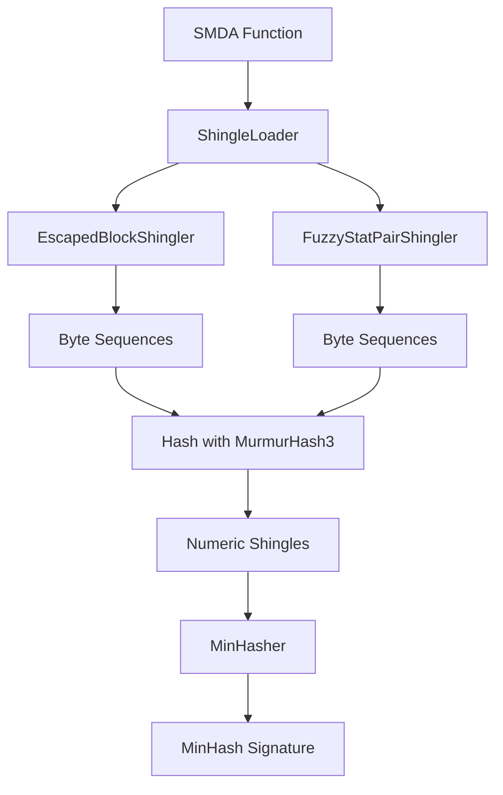

Shinglers are the foundation of MCRIT's MinHash-based similarity detection. They transform disassembled functions into sets of features (shingles) that can be hashed and compared.

## What is a Shingler?

A **shingler** extracts specific features from a disassembled function and converts them into hashable byte sequences. Each shingler focuses on different aspects of code:

- **Instruction patterns** (escaped opcodes and operands)
- **Control flow characteristics** (block counts, call patterns)
- **Statistical properties** (instruction type distributions)

By combining multiple shinglers, MCRIT captures diverse code characteristics that remain stable across compilation variations.

## Shingler Architecture

### AbstractShingler Base Class

All shinglers inherit from `AbstractShingler`, which defines the interface and common functionality.

<CodeGroup>
```python Base Class Structure
# From mcrit/shinglers/AbstractShingler.py
class AbstractShingler:
    def __init__(self, plugin_name):
        self._name = plugin_name
        self._config = {}
        self._weight = 0
        self._use_weights = True
    
    @abstractmethod
    def _generateByteSequences(self, function_object):
        """Generate shingles from a function (must implement)"""
        raise NotImplementedError
    
    def process(self, function_object, hash_seed):
        """Hash the byte sequences into numeric shingles"""
        # Calls _generateByteSequences, then hashes results
        pass
```
</CodeGroup>

**Key responsibilities:**
- Define the `_generateByteSequences()` method to extract features
- Automatically hash byte sequences using MurmurHash3
- Support weighted contributions via XOR variants
- Provide helper methods like `_logbucket()` for fuzzy bucketing

Source: `mcrit/shinglers/AbstractShingler.py:11`

### Shingler Weights

Each shingler has a **weight** determining how many signature positions it can influence:

```python
# Example configuration
SHINGLERS_WEIGHTS = {
    "EscapedBlockShingler": 3,
    "FuzzyStatPairShingler": 2,
}
```

- Weight of 3 = shingler contributes to more of the signature
- Weight of 0 = shingler is disabled
- Higher weight = more influence on similarity scores

<Note>
Weights are implemented through XOR variants: a shingler with weight 3 generates its base shingles, then creates 2 additional variants by XORing with random values.
</Note>

Source: `mcrit/minhash/ShingleLoader.py:38`

## ShingleLoader

The `ShingleLoader` dynamically loads and initializes shinglers based on configuration.

<Steps>
  <Step title="Scan Directory">
    Finds all `*Shingler.py` files in the shingler directory
  </Step>
  
  <Step title="Import Classes">
    Dynamically imports each shingler class
  </Step>
  
  <Step title="Apply Weights">
    Instantiates shinglers according to configured weights
  </Step>
  
  <Step title="Generate XOR Values">
    Creates random XOR values for weighted variants
  </Step>
</Steps>

```python
# Weight strategies
WEIGHT_STRATEGY_ALL_SHINGLERS_EQUAL = 1  # All active shinglers, weight=1
WEIGHT_STRATEGY_SHINGLER_WEIGHTS = 2     # Use configured weights
```

Source: `mcrit/minhash/ShingleLoader.py:12`

## Built-in Shinglers

MCRIT includes two primary shinglers in active use:

### EscapedBlockShingler

**Purpose:** Captures instruction sequences with normalized operands

<Tabs>
  <Tab title="Overview">
    The `EscapedBlockShingler` extracts instruction patterns from basic blocks using SMDA's instruction escaping.
    
    **Key features:**
    - Groups mnemonics by category (move, arithmetic, control, etc.)
    - Escapes operands to remove absolute addresses and register specifics
    - Creates n-grams of escaped instructions
    - Filters stack operations (push/pop, esp/rsp)
  </Tab>
  
  <Tab title="Example">
    **Original instructions:**
    ```asm
    mov eax, [ebp+0x8]
    add eax, 0x10
    call 0x401000
    ret
    ```
    
    **After escaping:**
    ```
    M v,m        (Move from memory)
    A v,i        (Arithmetic with immediate)
    C i          (Call immediate)
    C            (Return)
    ```
    
    **Generated shingle:**
    ```
    "A v,i;C;C i"
    ```
  </Tab>
  
  <Tab title="Implementation">
    ```python
    def _escapeInstruction(self, instruction):
        return (
            instruction.getMnemonicGroup(IntelInstructionEscaper)
            + " "
            + instruction.getEscapedOperands(IntelInstructionEscaper)
        )
    
    def _maskInstructions(self, instructions, ngram_size=3):
        sequences = []
        escaped_sequence = [self._escapeInstruction(ins) 
                           for ins in instructions]
        if len(instructions) > ngram_size:
            for index in range(len(escaped_sequence) - ngram_size + 1):
                escaped_ngram = escaped_sequence[index : index + ngram_size]
                sequences.append(";".join(sorted(escaped_ngram)))
        else:
            sequences.append(";".join(sorted(escaped_sequence)))
        return sequences
    ```
  </Tab>
</Tabs>

**Why it works:** Instruction patterns remain similar across:
- Different compilers (MSVC, GCC, Clang)
- Optimization levels
- Minor code variations

Source: `mcrit/shinglers/EscapedBlockShingler.py:9`

### FuzzyStatPairShingler

**Purpose:** Captures statistical properties of functions with fuzzy bucketing

<Tabs>
  <Tab title="Overview">
    The `FuzzyStatPairShingler` extracts control flow and instruction statistics, using logarithmic bucketing to introduce fuzziness.
    
    **Extracted statistics:**
    - Number of calls (`num_calls`)
    - Number of specific instruction types (Control, Stack, Arithmetic, Move)
    - Stack frame size
    - Maximum basic block size
    - Strongly connected components (SCCs)
  </Tab>
  
  <Tab title="Log Bucketing">
    Instead of exact counts, values are placed into logarithmic buckets:
    
    ```python
    # Example: 37 instructions
    bucket_range = _getLogBucketRange(37)
    # Returns: (32, 37, 42)
    # Generates shingles for all three buckets
    ```
    
    This allows functions with similar (but not identical) characteristics to match.
    
    **Bucket progression:**
    - 0-3: exact values
    - 4-8: buckets of 2
    - 9-16: buckets of 4
    - 17-32: buckets of 8
    - And so on...
  </Tab>
  
  <Tab title="Generated Shingles">
    Example shingles from a function with:
    - 5 calls
    - 12 control instructions
    - 35 total instructions
    
    ```python
    [
        "num_calls:4",
        "num_calls:5",
        "num_calls:6",
        "num_ins_C:10",
        "num_ins_C:12",
        "num_ins_C:14",
        "num_ins_A_rel:25",
        "num_ins_A_rel:28",
        "num_ins_A_rel:32",
        # ... more statistics
    ]
    ```
  </Tab>
</Tabs>

**Why it works:** Statistical properties are resilient to:
- Register allocation differences
- Instruction reordering
- Minor optimizations

Source: `mcrit/shinglers/FuzzyStatPairShingler.py:12`

## Shingler Processing Pipeline



### Step-by-Step Example

<Steps>
  <Step title="Function Disassembly">
    SMDA disassembles a function into blocks and instructions
  </Step>
  
  <Step title="Shingler Execution">
    Each active shingler processes the function:
    - EscapedBlockShingler → 45 instruction n-grams
    - FuzzyStatPairShingler → 18 statistical shingles
  </Step>
  
  <Step title="Hashing">
    Each byte sequence is hashed with MurmurHash3:
    ```python
    shingle_hash = mmh3.hash("A v,i;C;C i", seed) & 0xFFFFFFFF
    # Result: 0x7A4B3C1D
    ```
  </Step>
  
  <Step title="MinHash Generation">
    MinHasher combines shingles using selected strategy to produce 256-value signature
  </Step>
</Steps>

## Advanced: Shingler Configuration

### Creating Custom Shinglers

You can implement custom shinglers by extending `AbstractShingler`:

```python
from AbstractShingler import AbstractShingler

class MyCustomShingler(AbstractShingler):
    def __init__(self, config, weight=1):
        super().__init__(__class__.__name__)
        self._config = config
        self._weight = weight
    
    def _generateByteSequences(self, function_object):
        sequences = []
        # Extract your custom features
        for block in function_object.blocks.values():
            # Example: hash block structure
            sequences.append(f"block_size:{block.length}")
        return sequences
```

<Note>
Place your custom shingler in `mcrit/shinglers/MyCustomShingler.py` and it will be automatically discovered by `ShingleLoader`.
</Note>

### Configuration Options

```python
# From ShinglerConfig
SHINGLER_DIR = "mcrit/shinglers"
SHINGLER_WEIGHT_STRATEGY = 2  # Use configured weights
SHINGLERS_SEED = 12345
SHINGLERS_XOR_VALUES = []  # Auto-generated

# Fuzzy bucketing for FuzzyStatPairShingler
SHINGLER_LOGBUCKETS = 256
SHINGLER_LOGBUCKET_RANGE = 2  # Create ±2 bucket variants
SHINGLER_LOGBUCKET_CENTERED = True
```

## Archived Shinglers

MCRIT includes many experimental shinglers in `mcrit/shinglers/archived/`:

- **MnemHistShingler** - Mnemonic histograms
- **MnemSeqShingler** - Mnemonic sequences
- **NgramShingler** - Instruction n-grams
- **TreeBfsShingler** - Control flow tree traversal
- **CallgraphStatsShingler** - Call graph properties

These are kept for research purposes but not actively used due to performance or accuracy concerns.

## Shingler Performance Characteristics

<AccordionGroup>
  <Accordion title="EscapedBlockShingler">
    **Speed:** Fast (processes ~1000 functions/second)
    
    **Accuracy:** High for similar code, resilient to:
    - ✅ Compiler variations
    - ✅ Optimization levels  
    - ✅ Register allocation
    
    **Weaknesses:**
    - ❌ Sensitive to instruction reordering
    - ❌ Can miss semantically equivalent code
  </Accordion>
  
  <Accordion title="FuzzyStatPairShingler">
    **Speed:** Very fast (processes ~5000 functions/second)
    
    **Accuracy:** Moderate, good for:
    - ✅ Finding functions with similar complexity
    - ✅ Matching across heavy optimizations
    - ✅ Complementing instruction-based shinglers
    
    **Weaknesses:**
    - ❌ Less discriminative (many functions have similar stats)
    - ❌ Not sufficient alone for accurate matching
  </Accordion>
</AccordionGroup>

## Best Practices

<CardGroup cols={2}>
  <Card title="Weight Balance" icon="scale-balanced">
    Give instruction-based shinglers (EscapedBlock) higher weight than statistical shinglers
  </Card>
  
  <Card title="Complementary Features" icon="puzzle-piece">
    Combine shinglers that capture different aspects (syntax + statistics)
  </Card>
  
  <Card title="Testing" icon="flask">
    Test custom shinglers on diverse sample sets to validate effectiveness
  </Card>
  
  <Card title="Performance" icon="gauge-high">
    Monitor shingler execution time - slow shinglers bottleneck analysis
  </Card>
</CardGroup>

## Related Concepts

<CardGroup cols={2}>
  <Card title="MinHash" icon="fingerprint" href="/concepts/minhash">
    How shingles are combined into similarity signatures
  </Card>
  <Card title="Architecture" icon="diagram-project" href="/concepts/architecture">
    Where shinglers fit in MCRIT's pipeline
  </Card>
</CardGroup>