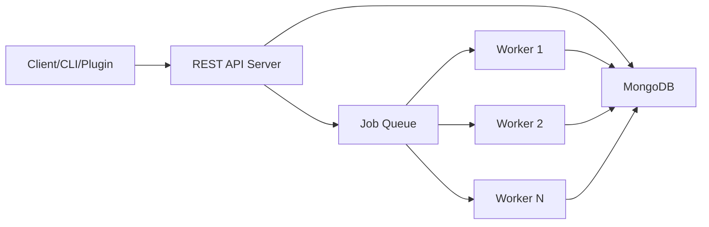

## What is MCRIT?

MCRIT (MinHash-based Code Relationship & Investigation Toolkit) is a framework created to simplify the application of the MinHash algorithm in the context of code similarity analysis. It enables rapid implementation of "shinglers" - methods which encode properties of disassembled functions for similarity estimation via the MinHash algorithm.

<Note>
  MCRIT is tailored to work with disassembly reports emitted by [SMDA](https://github.com/danielplohmann/smda) (Smart Disassembler)
</Note>

## Key Features

### MinHash-Based Similarity Detection
- **Fast similarity estimation** using MinHash algorithm for code comparison
- **Shingler framework** for encoding function properties from disassembled code
- **PicHash and PicBlockHash** support for position-independent code matching
- **Configurable band matching** to control fuzzy matching sensitivity

### Scalable Architecture
- **RESTful API server** for centralized data access and query processing
- **Worker-based processing** with support for multiple concurrent workers
- **MongoDB backend** for persistent storage and efficient indexing
- **Queue system** for asynchronous job processing

### Multiple Interaction Methods
- **Python client library** for programmatic access to all endpoints
- **Command-line interface (CLI)** for shell-based operations
- **IDA plugin** for interactive analysis within IDA Pro
- **Web interface** available via [docker-mcrit](https://github.com/danielplohmann/docker-mcrit)

### Analysis Capabilities
- Submit binaries (PE, ELF) or SMDA reports for analysis
- Match against reference databases of known malware families
- Identify unique code blocks across samples
- Cross-reference functions across multiple samples
- Export and import sample collections
- Search across families, samples, and functions

## Architecture Overview

MCRIT uses a distributed architecture with two main components:

<Steps>
  <Step title="Server Component">
    Provides a REST API interface listening on `http://127.0.0.1:8000/` by default. The server handles:
    - API endpoint routing
    - Data storage via MongoDB
    - Job queue management
    - Results delivery
  </Step>

  <Step title="Worker Component">
    Processes queued analysis jobs asynchronously. Workers handle:
    - Binary disassembly (via SMDA)
    - MinHash calculation
    - Similarity matching
    - Cross-matching operations
    
    Multiple workers can run concurrently for parallel processing.
  </Step>
</Steps>

## Use Cases

### Malware Analysis
- **Family attribution**: Match unknown samples against known malware families
- **Variant tracking**: Identify code reuse across malware variants
- **Campaign analysis**: Detect relationships between samples from the same threat actor
- **Code evolution**: Track how malware code changes over time

### Reverse Engineering
- **Library identification**: Recognize common libraries and third-party code
- **Code search**: Find similar functions across large binary collections
- **Vulnerability research**: Identify code patterns across different software versions
- **Binary diffing**: Compare functions between different builds or architectures

### Threat Intelligence
- **Reference database building**: Create databases of known malware families and benign software
- **Automated triaging**: Quickly classify new samples based on similarity
- **Attribution analysis**: Link samples to threat groups based on code sharing
- **Hunting pivots**: Find related samples for incident response

## Key Concepts

<Accordion title="MinHash Algorithm">
  MinHash is a locality-sensitive hashing technique that estimates the Jaccard similarity between sets. In MCRIT, it's used to quickly compare disassembled functions by:
  1. Extracting features (shingles) from disassembled code
  2. Computing MinHash signatures from these features
  3. Using band indexing for fast candidate retrieval
  4. Calculating precise similarity scores for candidates
</Accordion>

<Accordion title="Shinglers">
  Shinglers are methods that encode properties of disassembled functions into comparable features. MCRIT supports multiple shingler types that capture different aspects of code:
  - Instruction sequences
  - Control flow patterns
  - API call sequences
  - Position-independent code patterns
</Accordion>

<Accordion title="PicHash">
  Position-Independent Code Hash (PicHash) is a specialized hash that captures the semantic structure of code while being resilient to:
  - Address changes
  - Recompilation
  - Minor code variations
  
  This makes it particularly useful for matching code across different samples and architectures.
</Accordion>

## Reference Data

MCRIT provides ready-to-use reference data for common compilers and libraries through the [mcrit-data repository](https://github.com/danielplohmann/mcrit-data). This includes:
- Standard C/C++ runtime libraries
- Common third-party libraries
- Compiler-specific code patterns
- Windows API wrappers

<Info>
  Using reference data helps filter out common code and focus on unique malware functionality.
</Info>

## Next Steps

<CardGroup cols={2}>
  <Card title="Installation" icon="download" href="/installation">
    Set up MCRIT using Docker or standalone installation
  </Card>
  <Card title="Quickstart" icon="rocket" href="/quickstart">
    Submit your first sample and run your first analysis
  </Card>
</CardGroup>

## Version Information

Current version: **v1.4.6** (January 2026)

<Warning>
  Version 1.3.0 introduced breaking changes with improved PicHash and MinHash indexing. Migration guides are available in the source repository.
</Warning>
